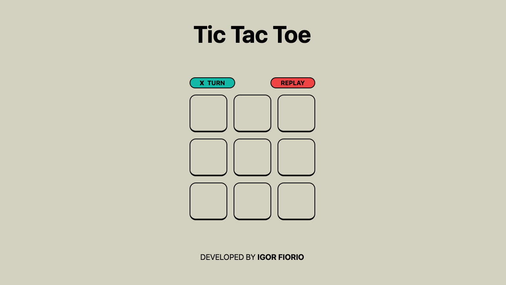

# A Tic Tac Toe game

Link to the website → _[Tic Tac Toe](https://s2i-tictactoe.vercel.app/)_

This project is developed using _Nuxt_(a _Vue_ framework) and Tailwind CSS.

## How to play

- Click on any box to start the game(the first move always starts with the _cross_)
- The second move is the opponent's and so on alternating
- To win you need to have _cross_ or _nought_ three times on the same line
  (vertically, horizontally or diagonally)
- The _REPLAY_ button will reset the game
